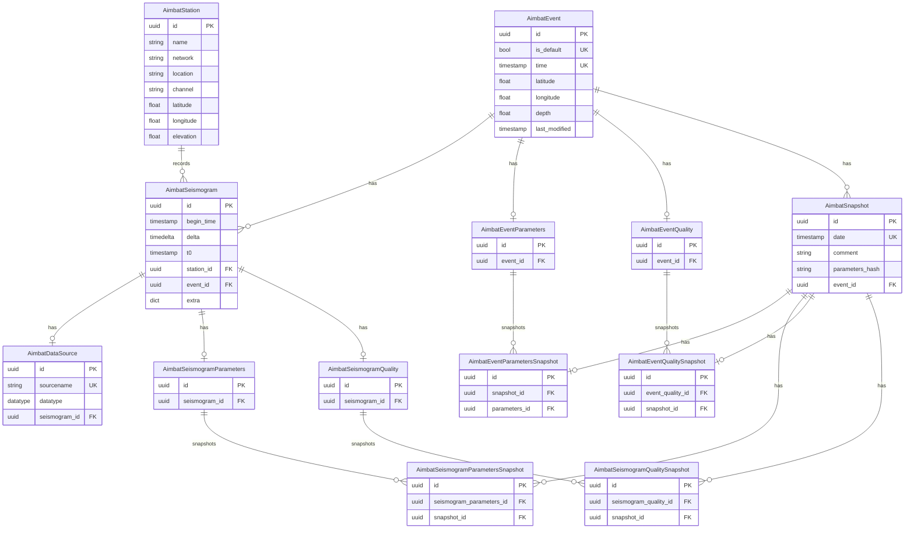

# AIMBAT Database Models

## Relationships Summary

- **AimbatStation** → **AimbatSeismogram**: One-to-Many (a station records many seismograms)
- **AimbatEvent** → **AimbatSeismogram**: One-to-Many (an event has many seismograms)
- **AimbatEvent** → **AimbatEventParameters**: One-to-One (an event has one set of parameters)
- **AimbatEvent** → **AimbatEventQuality**: One-to-One (an event has one quality record)
- **AimbatEvent** → **AimbatSnapshot**: One-to-Many (an event can have many snapshots)
- **AimbatSeismogram** → **AimbatDataSource**: One-to-One (a seismogram has one datasource)
- **AimbatSeismogram** → **AimbatSeismogramParameters**: One-to-One
- **AimbatSeismogram** → **AimbatSeismogramQuality**: One-to-One
- **AimbatSnapshot** → **AimbatEventParametersSnapshot**: One-to-One
- **AimbatSnapshot** → **AimbatSeismogramParametersSnapshot**: One-to-Many
- **AimbatSnapshot** → **AimbatEventQualitySnapshot**: One-to-One
- **AimbatSnapshot** → **AimbatSeismogramQualitySnapshot**: One-to-Many

## Notes

- All primary keys are UUIDs
- Foreign keys use CASCADE delete
- UK = Unique Key
- FK = Foreign Key
- Snapshot tables store historical copies of parameters and quality metrics for rollback/analysis
