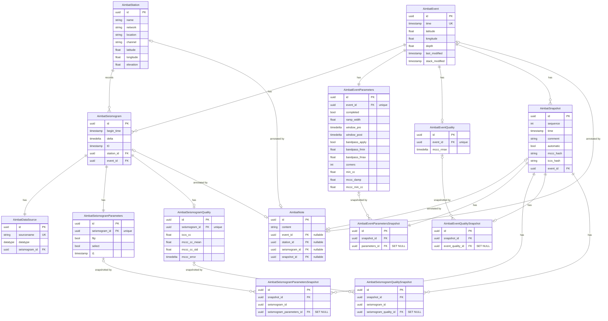

# AIMBAT database models


```mermaid
erDiagram
    AimbatStation ||--o{ AimbatSeismogram : "records"
    AimbatEvent ||--o{ AimbatSeismogram : "has"
    AimbatEvent ||--|| AimbatEventParameters : "has"
    AimbatEvent ||--o| AimbatEventQuality : "has"
    AimbatEvent ||--o{ AimbatSnapshot : "has"
    AimbatSeismogram ||--|| AimbatDataSource : "has"
    AimbatSeismogram ||--|| AimbatSeismogramParameters : "has"
    AimbatSeismogram ||--o| AimbatSeismogramQuality : "has"

    AimbatEvent      |o--o| AimbatNote : "annotated by"
    AimbatStation    |o--o| AimbatNote : "annotated by"
    AimbatSeismogram |o--o| AimbatNote : "annotated by"
    AimbatSnapshot   |o--o| AimbatNote : "annotated by"

    AimbatSnapshot ||--|| AimbatEventParametersSnapshot : "has"
    AimbatSnapshot ||--o{ AimbatSeismogramParametersSnapshot : "has"
    AimbatSnapshot ||--o| AimbatEventQualitySnapshot : "has"
    AimbatSnapshot ||--o{ AimbatSeismogramQualitySnapshot : "has"

    AimbatEventParameters |o--o{ AimbatEventParametersSnapshot : "snapshotted by"
    AimbatSeismogramParameters |o--o{ AimbatSeismogramParametersSnapshot : "snapshotted by"
    AimbatEventQuality |o--o{ AimbatEventQualitySnapshot : "snapshotted by"
    AimbatSeismogramQuality |o--o{ AimbatSeismogramQualitySnapshot : "snapshotted by"

    AimbatStation {
        uuid id PK
        string name
        string network
        string location
        string channel
        float latitude
        float longitude
        float elevation
    }

    AimbatEvent {
        uuid id PK
        timestamp time UK
        float latitude
        float longitude
        float depth
        timestamp last_modified
        timestamp stack_modified
    }

    AimbatSeismogram {
        uuid id PK
        timestamp begin_time
        timedelta delta
        timestamp t0
        uuid station_id FK
        uuid event_id FK
    }

    AimbatDataSource {
        uuid id PK
        string sourcename UK
        datatype datatype
        uuid seismogram_id FK
    }

    AimbatEventParameters {
        uuid id PK
        uuid event_id FK "unique"
        bool completed
        float ramp_width
        timedelta window_pre
        timedelta window_post
        bool bandpass_apply
        float bandpass_fmin
        float bandpass_fmax
        int corners
        float min_cc
        float mccc_damp
        float mccc_min_cc
    }

    AimbatSeismogramParameters {
        uuid id PK
        uuid seismogram_id FK "unique"
        bool flip
        bool select
        timestamp t1
    }

    AimbatEventQuality {
        uuid id PK
        uuid event_id FK "unique"
        timedelta mccc_rmse
    }

    AimbatSeismogramQuality {
        uuid id PK
        uuid seismogram_id FK "unique"
        float iccs_cc
        float mccc_cc_mean
        float mccc_cc_std
        timedelta mccc_error
    }

    AimbatSnapshot {
        uuid id PK
        int sequence
        timestamp time
        string comment
        bool automatic
        string mccc_hash
        string iccs_hash
        uuid event_id FK
    }

    AimbatEventParametersSnapshot {
        uuid id PK
        uuid snapshot_id FK
        uuid parameters_id FK "SET NULL"
    }

    AimbatSeismogramParametersSnapshot {
        uuid id PK
        uuid snapshot_id FK
        uuid seismogram_id
        uuid seismogram_parameters_id FK "SET NULL"
    }

    AimbatEventQualitySnapshot {
        uuid id PK
        uuid snapshot_id FK
        uuid event_quality_id FK "SET NULL"
    }

    AimbatSeismogramQualitySnapshot {
        uuid id PK
        uuid snapshot_id FK
        uuid seismogram_id
        uuid seismogram_quality_id FK "SET NULL"
    }

    AimbatNote {
        uuid id PK
        string content
        uuid event_id FK "nullable"
        uuid station_id FK "nullable"
        uuid seismogram_id FK "nullable"
        uuid snapshot_id FK "nullable"
    }
```

## Relationships summary

- **AimbatStation** → **AimbatSeismogram**: one-to-many
- **AimbatEvent** → **AimbatSeismogram**: one-to-many
- **AimbatEvent** → **AimbatEventParameters**: one-to-one, mandatory
- **AimbatEvent** → **AimbatEventQuality**: one-to-one, created on the first MCCC run
- **AimbatEvent** → **AimbatSnapshot**: one-to-many
- **AimbatSeismogram** → **AimbatDataSource**: one-to-one, mandatory
- **AimbatSeismogram** → **AimbatSeismogramParameters**: one-to-one, mandatory
- **AimbatSeismogram** → **AimbatSeismogramQuality**: one-to-one, created on the first ICCS/MCCC run
- **AimbatEvent / AimbatStation / AimbatSeismogram / AimbatSnapshot** → **AimbatNote**: each has at most one note; a note has exactly one parent
- **AimbatSnapshot** → **AimbatEventParametersSnapshot**: one-to-one
- **AimbatSnapshot** → **AimbatSeismogramParametersSnapshot**: one-to-many
- **AimbatSnapshot** → **AimbatEventQualitySnapshot**: one-to-one, optional
- **AimbatSnapshot** → **AimbatSeismogramQualitySnapshot**: one-to-many
- Each live parameter/quality row → its `*Snapshot` rows: one-to-many, with the
  snapshot's back-reference nullable (`SET NULL`)

## Notes

- All primary keys are UUIDs. `UK` = unique constraint, `FK` = foreign key.
- **Deletes cascade down the ownership tree.** Deleting an event removes its
  seismograms, parameters, quality, snapshots, and every snapshot sub-row;
  deleting a seismogram removes its data source, parameters, and quality;
  deleting a snapshot removes its four sub-rows. A note is removed with its
  parent.
- **Snapshot → live-record links use `SET NULL`, not cascade.**
  `AimbatEventParametersSnapshot.parameters_id`,
  `AimbatSeismogramParametersSnapshot.seismogram_parameters_id`, and the two
  quality equivalents go `NULL` when the live row is deleted, so historical
  snapshots survive. The seismogram-level snapshot tables also keep their own
  denormalised `seismogram_id` for the same reason.
- **One-to-one links are DB-enforced** by unique indexes on
  `AimbatEventParameters.event_id`, `AimbatSeismogramParameters.seismogram_id`,
  `AimbatEventQuality.event_id`, `AimbatSeismogramQuality.seismogram_id`, and
  `AimbatDataSource.sourcename`.
- **`AimbatSnapshot`** is keyed by `(event_id, sequence)`. `sequence` is a
  monotonic per-event counter that defines snapshot order. `mccc_hash` /
  `iccs_hash` are SHA-256 of the parameters affecting each algorithm's output at
  capture time; both null until those parameters exist.
- **`AimbatNote`** holds exactly one of `event_id` / `station_id` /
  `seismogram_id` / `snapshot_id` (a `CHECK` constraint), with a partial unique
  index per FK so a parent has at most one note.
- **`AimbatEvent.stack_modified`** bumps only on parameters that force an ICCS
  rebuild (event window, ramp, bandpass, corners; per-seismogram `t1` / `flip` /
  `select`); `last_modified` bumps on any parameter change. Both are maintained
  by triggers, alongside the quality-nulling triggers in
  [Quality metric invalidation](quality-invalidation.md).
- The `*Snapshot` parameter and quality tables inherit every column from the
  same base class as their live counterpart (`AimbatEventParametersBase`,
  `AimbatSeismogramParametersBase`, `AimbatEventQualityBase`,
  `AimbatSeismogramQualityBase`); only their structural columns are shown above.
```