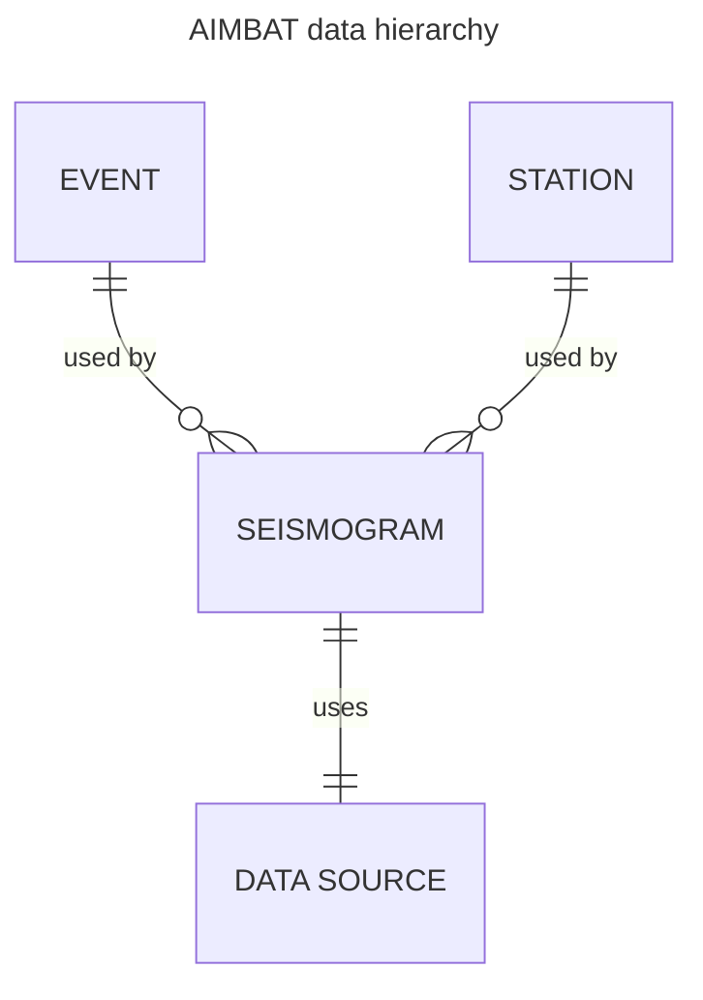

# Data

AIMBAT treats input data as read-only. Processing parameters and results are
stored separately in a database. Once imported, data sources (e.g. SAC files)
are only read for waveform data — all metadata (event and station information)
is stored in the database.

## Data hierarchy

A seismogram in AIMBAT is a database object that links a data source, a
station, and an event. Stations and events are shared across seismograms.


```mermaid
---
title: AIMBAT data hierarchy
---
erDiagram
    EVENT ||--o{ SEISMOGRAM : "used by"
    STATION ||--o{ SEISMOGRAM : "used by"
    SEISMOGRAM ||--|| "DATA SOURCE" : uses


```

!!! tip
    Seismograms that belong together are identified solely by shared event and
    station records in the database. You can organise data files freely on disk,
    but the metadata must match exactly — small differences (e.g. rounding in
    coordinates) may cause AIMBAT to treat seismograms as belonging to different
    events or stations.

## Deleting items

- Deleting[^1] an event or station removes all associated seismograms.
- Deleting a seismogram does *not* remove the event or station, even if they
  are no longer referenced by any seismogram.

[^1]:
    Deleting items from a project drops them from the database only. AIMBAT
    will *never* delete or modify any files.

## Project file

An AIMBAT project is a single [SQLite](https://www.sqlite.org){ target="_blank" }
file, created automatically when a new project is initialised. All project
state lives in this file. You do not need to understand the database schema for
normal use, but tools like
[DB Browser for SQLite](https://sqlitebrowser.org){ target="_blank" } are
useful for inspecting the raw data when debugging unexpected behaviour.

{ loading=lazy }

## Parameters

Parameters are organised in three tiers:

1. **AIMBAT defaults** — global settings that control application behaviour and
   provide initial values for event and seismogram parameters. Listed with
   `#!bash aimbat utils settings`. Stored outside the project file, since some
   settings are needed before a project exists.
2. **Event parameters** — shared across all seismograms of an event (e.g. time
   window, filter settings, completed flag). Attributes of
   [`AimbatEventParametersBase`][aimbat.models.AimbatEventParametersBase].
3. **Seismogram parameters** — specific to a single seismogram (e.g. arrival
   time pick, select/deselect flag). Attributes of
   [`AimbatSeismogramParametersBase`][aimbat.models.AimbatSeismogramParametersBase].

## Snapshots

Event and seismogram parameters can be snapshot at any point during processing.
Snapshots are independent copies of the parameter state — rolling back to one
restores parameters exactly without affecting other snapshots.

!!! tip
    Create a snapshot immediately after importing data, before any processing
    has been done.

## UUIDs

All items in a project are identified internally by
[UUIDs](https://en.wikipedia.org/wiki/Universally_unique_identifier):

```text
37a8245f-c508-46a7-9bbc-d1c601e42983
```

Full UUIDs are unwieldy to type, so AIMBAT presents truncated forms — using
only as many characters as needed to be unambiguous within the project. For
example, four seismograms with these IDs:

```text
6a4acdf7-6c7b-4523-aaaa-0a674cdc5f2d
647568aa-8361-45ef-bfc8-61f873847f17
c980918d-106d-44d9-a3fa-5740f58edf4e
5dcb5c4b-b416-4a7b-870f-9a8da42a7dd2
```

can be unambiguously referenced as:

```text
6a
64
c9
5d
```

If two characters are insufficient, three are used, and so on.
