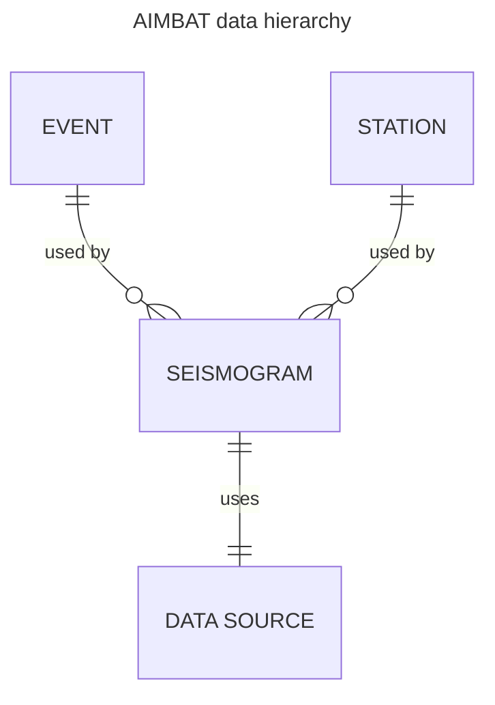
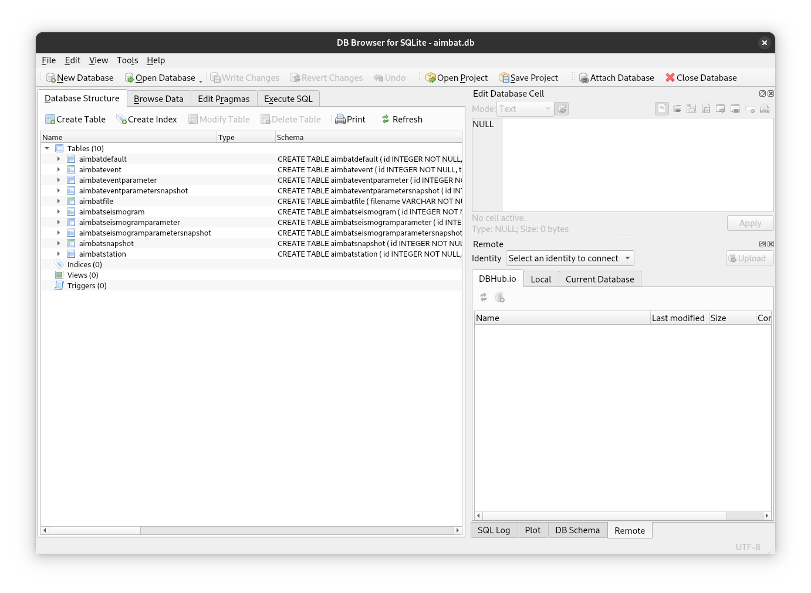

# Data

AIMBAT treats input data as read-only. Processing parameters and results are
stored separately from the data in a database. Once imported into a project,
the data sources (e.g. SAC files) are only used to read the waveforms. All
metadata (e.g. event and station information) is stored in the database.

## Data hierarchy

Moving away from storing all data in individual files means things are
organised differently. For example, a seismogram in AIMBAT is no longer a file;
it is an object in the database that links to a data source, station and event.
Stations and events are also objects in the database, and they are shared
between seismograms.


```mermaid
---
title: AIMBAT data hierarchy
---
erDiagram
    EVENT ||--o{ SEISMOGRAM : "used by"
    STATION ||--o{ SEISMOGRAM : "used by"
    SEISMOGRAM ||--|| "DATA SOURCE" : uses


```

!!! Tip
    Seismograms that are supposed to be processed together are identified only
    by their shared event and station in the database. You can therefore be
    quite flexible in how you organise your data on disk, but you must make
    sure they reference the exact same station and event information — small
    differences in the metadata (e.g. a different number of decimal places) may
    lead to AIMBAT treating seismograms as belonging to different events or
    stations.

## Deleting items

All of the above happens transparently to the user, but there are some things to
be mindful of when it comes to deleting items from a project:

- Deleting[^1] an event or station from a project will remove all related
  seismograms.
- Conversely, deleting a seismogram will *not* remove the event or station.
  This remains true even if an event or station end up not being used by any
  seismograms in the project.

!!! Tip
    If this all seems overly complicated to you, remember that often parameters
    that apply to all seismograms of an event need to be changed to
    the same value. Organising the data like this means we only need to change
    the parameters in one place. And there are some additional
    [benefits](#snapshots) when setting things up this way!

[^1]:
    Deleting items from a project simply drops them from the project. AIMBAT
    will *never* delete (or modify) any files.

## Project file

If the above section sounded a bit "databasey" to you, that is because you are
spot on! AIMBAT projects consist of a single
[sqlite](https://www.sqlite.org){ target="_blank" } file (which is
automatically generated when a new project is created). This file contains a
database to manage all aspects of an AIMBAT project. Understanding the
internals of this file (or all the tables used in the database) is not
particularly important for normal usage, though it might be useful to look at
the data directly in cases where AIMBAT behaves in unexpected ways (e.g. due to
inconsistencies in the seismogram files used as input). To do this we suggest
viewing the database in tools such as
[DB Browser for SQLite](https://sqlitebrowser.org){ target="_blank" }.
{ loading=lazy }

## Parameters

As alluded to above, there is a hierarchy to how data are structured in AIMBAT,
and a major benefit of this is that parameters can be applied at different
levels. Thus there are three tiers of parameters that control behaviour and
processing:

  1. AIMBAT defaults: shared across all events and seismograms in a project.
  2. Event parameters: specific to an event (or shared across all seismograms
    of that event).
  3. Seismogram parameters: specific to a single seismogram.

### AIMBAT Defaults

AIMBAT [defaults](../usage/defaults.md) are global settings that control how
the application itself behaves, as well as defaults for
[event](#event-parameters) and [seismogram](#seismogram-parameters) parameters
when they are instantiated. The currently used values for these parameters can
be listed by running `#!bash aimbat utils settings` in the terminal. As some
settings are relevant before a project is created, they cannot be stored in
the project file.

### Event Parameters

Event parameters are used during processing. They are parameters that are
specific to an event (e.g. if an event should be marked as completed), or
parameters that are shared across all seismograms of that event (e.g. time
window for the cross-correlation, filter parameters, etc.).
These parameters are attributes of the
[`AimbatEventParametersBase`][aimbat.models.AimbatEventParametersBase]
class.

### Seismogram Parameters

Seismogram parameters are also used during processing. Most notably the time
picks belong to this tier. These parameters are attributes of the
[`AimbatSeismogramParametersBase`][aimbat.models.AimbatSeismogramParametersBase]
class.

## Snapshots

The event and seismogram parameters are stored separately from the events and
seismograms (much like the seismograms link to an event and station instead of
saving them in the same object). This opens up the possibility to save an
arbitrary number of copies of these parameters that capture the current state
of processing. This allows for risk-free experimentation with different
parameters - if something goes wrong, you can always roll back to the last (or
any other) snapshot.

!!! tip
    It is always a good idea to create a snapshot right after importing new
    data!

## UUID (Universally Unique Identifiers)

Internally, the items in a project use
[UUIDs](https://en.wikipedia.org/wiki/Universally_unique_identifier) to
identify themselves. They look something like this:

```text
37a8245f-c508-46a7-9bbc-d1c601e42983
```

The length and randomness of these identifiers guarantee no two items will ever
have the same ID (even if generated on two separate computers, in different
databases etc.), but they are a bit unwieldy to use directly. To make things
easier, they are typically presented in a truncated form to the user (but
always long enough to be unique). For example, if there are only four
seismograms and they have these UUIDS:

```text
6a4acdf7-6c7b-4523-aaaa-0a674cdc5f2d
647568aa-8361-45ef-bfc8-61f873847f17
c980918d-106d-44d9-a3fa-5740f58edf4e
5dcb5c4b-b416-4a7b-870f-9a8da42a7dd2
```

they can still be unambiguously identified using only the first two characters:

```text
6a
64
c9
5d
```

If two characters are insufficient, then three will be used, and so on.
