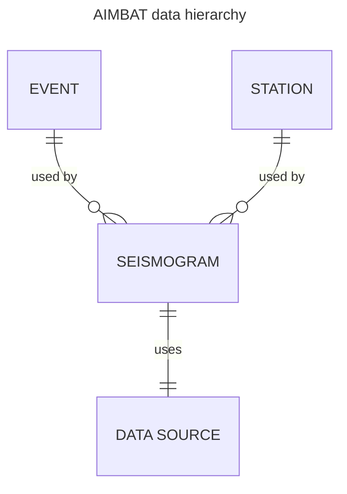
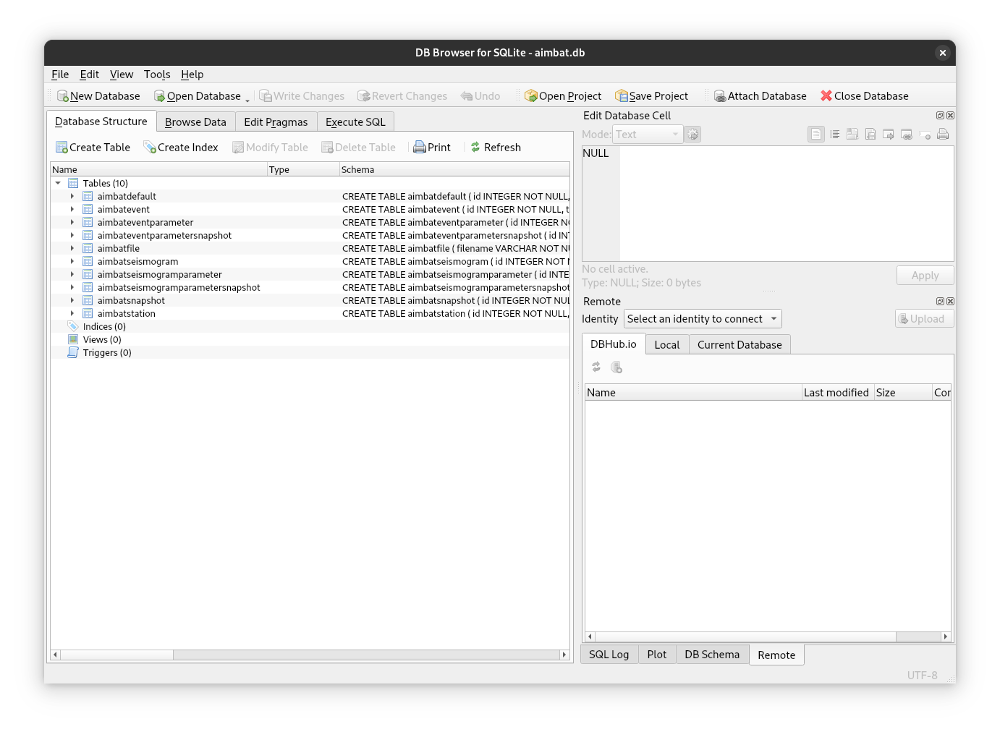

# Data

AIMBAT treats input data as read-only. Processing parameters and results are
stored separately in a database. Once imported, data sources (e.g. SAC files)
are only read for waveform data — all metadata (event and station information)
is stored in the database.

!!! tip "There is no save button"

    Changes to parameters (e.g. picks, filter settings, select/deselect flags) are
    written to the database immediately — in both the CLI and the TUI. There is no
    separate save step, and no undo. Use [snapshots](#snapshots) to capture a
    point-in-time copy of the parameter state that you can roll back to later.

## Data hierarchy

A seismogram in AIMBAT is a database object that links a data source, a station,
and an event. Stations and events are shared across seismograms. This somewhat
abstract concept is typically transparent to users, but it is important to
understand the implications when deleting items from a project.


```mermaid
---
title: AIMBAT data hierarchy
---
erDiagram
    EVENT ||--o{ SEISMOGRAM : "used by"
    STATION ||--o{ SEISMOGRAM : "used by"
    SEISMOGRAM ||--|| "DATA SOURCE" : uses
```

!!! tip "How are seismograms associated with events (and stations)?"

    Seismograms that belong together are identified solely by shared event and
    station records in the database. You can organise data files freely on disk, but
    the metadata must match exactly — small differences (e.g. rounding in
    coordinates) may cause AIMBAT to treat seismograms as belonging to different
    events or stations.

## Deleting items

The relationships between events, stations, and seismograms determine what
happens when you delete an item from a project:

- Deleting[^1] an event or station removes all associated seismograms.
- Deleting a seismogram does *not* remove the event or station, even if they are
    no longer referenced by any seismogram.

!!! tip "A real-world analogy"

    The above rules can be understood in terms of how these objects exist (or not)
    in the real world. A station or event can exist independently of any
    seismograms, but a seismogram cannot exist if an event never happened or a
    station never recorded it.

## Project file

An AIMBAT project is a single
[SQLite](https://www.sqlite.org){ target="_blank" } file, created automatically
when a new project is initialised. All project state lives in this file. You do
not need to understand the database schema for normal use, but tools like
[DB Browser for SQLite](https://sqlitebrowser.org){ target="_blank" } are useful
for inspecting the raw data when debugging unexpected behaviour.

{ loading=lazy }

!!! tip "Keeping the schema up to date"

    AIMBAT occasionally changes the project database schema between releases. If an
    existing project's schema is out of date, commands refuse to run (and the TUI
    blocks with a modal) until you run `#!bash aimbat db upgrade` to bring the
    project up to date. This never happens automatically, and existing data are
    never lost.

## Parameters

Parameters are organised in three tiers:

1. **AIMBAT defaults** — global settings that control application behaviour and
    provide initial values for event and seismogram parameters. Listed with
    `#!bash aimbat utils settings`. Stored outside the project file, since some
    settings are needed before a project exists.
2. **Event parameters** — shared across all seismograms of an event (e.g. time
    window, filter settings, completed flag). Attributes of
    [`AimbatEventParametersBase`][aimbat.models.AimbatEventParametersBase].
3. **Seismogram parameters** — specific to a single seismogram (e.g. arrival
    time pick, select/deselect flag). Attributes of
    [`AimbatSeismogramParametersBase`][aimbat.models.AimbatSeismogramParametersBase].

## Snapshots

Event and seismogram parameters can be captured in a snapshot at any point
during processing. Snapshots are independent copies of the parameter state —
rolling back to one restores parameters exactly without affecting other
snapshots. Importing data automatically snapshots each event that received new
seismograms, giving you a baseline to restore the original parameter state
without any extra step.

!!! warning "Adding data after a snapshot"

    Snapshots only capture the state of items that exist at the time they are taken.
    Items added afterwards are not included. When previewing a rollback, AIMBAT
    shows what the full dataset would look like after the rollback — items not in
    the snapshot appear with their current live state.

## UUIDs

All items in a project are identified internally by
[UUIDs](https://en.wikipedia.org/wiki/Universally_unique_identifier):

```text
37a8245f-c508-46a7-9bbc-d1c601e42983
```

Full UUIDs are unwieldy to type, so AIMBAT presents truncated forms — using only
as many characters as needed to be unambiguous within the project. For example,
four seismograms with these IDs:

```text
6a4acdf7-6c7b-4523-aaaa-0a674cdc5f2d
647568aa-8361-45ef-bfc8-61f873847f17
c980918d-106d-44d9-a3fa-5740f58edf4e
5dcb5c4b-b416-4a7b-870f-9a8da42a7dd2
```

can be unambiguously referenced as:

```text
6a
64
c9
5d
```

If two characters are insufficient, three are used, and so on.

[^1]: Deleting items from a project drops them from the database only. AIMBAT
    will *never* delete or modify any files.
