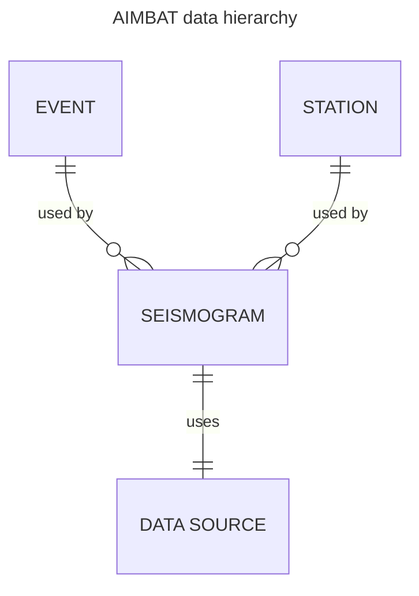

# Data and conventions

AIMBAT never changes the input data. After import, a data source such as a SAC or
JSON file is read only for its waveform samples. Everything else lives in a
database: event and station metadata, processing parameters, and results.

## The project file

That database is a single [SQLite](https://www.sqlite.org){ target="_blank" }
file, created when a project is initialised. All project state lives in it.
Normal use never requires understanding the schema, but a viewer like
[DB Browser for SQLite](https://sqlitebrowser.org){ target="_blank" } is useful
for inspecting the raw data when something behaves unexpectedly.

{ loading=lazy }

!!! tip "Keeping the schema up to date"

    AIMBAT occasionally changes the database schema between releases. If a
    project's schema is out of date, the CLI refuses to run and the TUI blocks
    with a modal until `#!bash aimbat db upgrade` is run. This is never
    automatic, and no data are lost.

## Data hierarchy

A seismogram is a database record linking one data source to a station and an
event. Stations and events are shared: many seismograms can reference the same
event record. This matters when deleting items, below.


```mermaid
---
title: AIMBAT data hierarchy
---
erDiagram
    EVENT ||--o{ SEISMOGRAM : "used by"
    STATION ||--o{ SEISMOGRAM : "used by"
    SEISMOGRAM ||--|| "DATA SOURCE" : uses
```

!!! tip "Grouping is by metadata, not by file location"

    Seismograms are grouped into events and stations solely by matching records
    in the database. Any on-disk layout works; the metadata must match exactly.
    A small difference such as a rounded coordinate makes AIMBAT treat two
    seismograms as belonging to different stations or events.

A project can hold many events. ICCS, MCCC, and snapshots act on one event at a
time, so the current event must be selected before running them. See
[Selecting an Event](../usage/event-selection.md).

## Deleting items

Deletion follows the hierarchy:

- Deleting[^1] an event or station also deletes its seismograms.
- Deleting a seismogram leaves its event and station in place, even if nothing
    else references them.

!!! tip "The logic behind the rules"

    An event or station can exist without any seismogram, but a seismogram
    cannot exist without an event to record and a station to record it.

See [Removing data](../usage/data.md#removing-data) for the commands.

## Parameters

Parameters are organised in three tiers:

1. **AIMBAT defaults.** Global settings for application behaviour and the initial
    values of event and seismogram parameters. Stored outside the project file,
    since some are needed before a project exists. See
    [Aimbat Defaults](../usage/defaults.md).
2. **Event parameters.** Shared by every seismogram of an event, such as the time
    window and filter settings. Attributes of
    [`AimbatEventParametersBase`][aimbat.models.AimbatEventParametersBase].
3. **Seismogram parameters.** Specific to one seismogram, such as the
    arrival-time pick and the select/deselect flag. Attributes of
    [`AimbatSeismogramParametersBase`][aimbat.models.AimbatSeismogramParametersBase].

!!! tip "There is no save button"

    Parameter changes (a pick, a filter setting, a select flag) are written to
    the database immediately, in every interface. There is no save step and no
    undo. [Snapshots](#snapshots) capture a state to roll back to.

## Snapshots

A snapshot is an independent copy of all event and seismogram parameters, taken
at any point during processing. Rolling back restores those parameters exactly
and leaves other snapshots untouched. Importing data snapshots each affected
event automatically, so the imported state is always recoverable.

!!! warning "Adding data after a snapshot"

    A snapshot only captures items that exist when it is taken. Items added later
    are not in it. A rollback preview shows the whole dataset as it would look
    afterwards, with those newer items keeping their current live state.

See [Snapshots](../usage/snapshots.md) for taking and comparing them.

## UUIDs

Every item in a project is identified internally by a
[UUID](https://en.wikipedia.org/wiki/Universally_unique_identifier):

```text
37a8245f-c508-46a7-9bbc-d1c601e42983
```

Typing these in full is impractical, so AIMBAT displays and accepts truncated
forms, using only as many leading characters as needed to be unambiguous within
the project. Four seismograms with these IDs:

```text
6a4acdf7-6c7b-4523-aaaa-0a674cdc5f2d
647568aa-8361-45ef-bfc8-61f873847f17
c980918d-106d-44d9-a3fa-5740f58edf4e
5dcb5c4b-b416-4a7b-870f-9a8da42a7dd2
```

can be referenced as:

```text
6a
64
c9
5d
```

If two characters are not enough, three are used, and so on.

[^1]: Deleting items from a project drops them from the database only. AIMBAT
    will *never* delete or modify any files.
