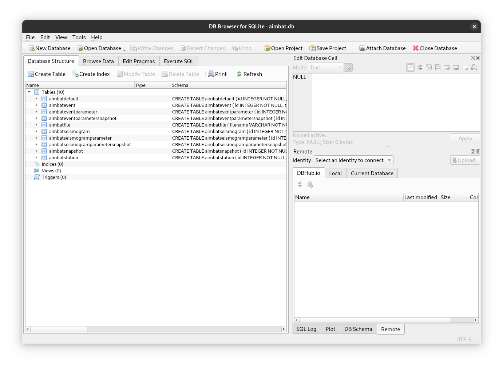

# Data

Because a lot of operations in AIMBAT involve adjusting parameters that do
*not* require reading entire seismograms, the time series components of the
seismograms are kept separate from the rest of the data. If this were not the
case, doing something like adjusting the time window for the cross-correlation
for an event with 200 seismograms, would require reading all 200 seismograms
from disk, even though their data are not actually used for that operation. Not
having to do this naturally benefits performance, but also means that an AIMBAT
project does not really use up much disk space at all. As this is true for any
amount of seismograms, we can include multiple events in a single project.

## Data hierarchy

Moving away from storing all data in individual files means things are
organised differently. Most importantly, seismograms, after importing them into
a project, no longer each contain event and station information. Instead they
use (and share) separately stored events and stations. Thus a single event will
contain multiple seismograms. The same is true for a single station, while the
seismograms themselves use exactly one event, one station, and one data source
(containing the time series).

While all of this happens transparently to the user, there are still some
things to be mindful of:

- Seismograms that are supposed to be processed together are no longer
  identified e.g. by being stored in the same directory, but instead from using
  the same event and station. Thus the files they are created from when adding
  them to an AIMBAT project *must* contain identical station and event data.
- Deleting[^1] an event or station from a project will remove all related
  seismograms.
- Conversely, deleting a seismogram will *not* remove the event or
  station. This remains true even if an event or station end up not being used
  by any seismograms in the project.
- After importing a seismogram into a project, it no longer accesses the
  metadata stored in the source file. It does, however, still need to be able
  to read the time series data from it.

[^1]: Deleting items from a project simply drops them from the project. AIMBAT
will *never* delete (or modify) any files.

!!! Tip
    If this all seems overly complicated to you, remember that often parameters
    that apply to all seismograms of an event need to be changed to
    the same value. Organising the data like this means we only need to change
    the parameters in one place. And there are some additional
    [perks](#snapshots) when setting things up this way!
  
## Project file

If the above section sounded a bit "databasey" to you, that is because you are
spot on! AIMBAT projects consist of a single
[sqlite](https://www.sqlite.org){ target="_blank" } file (which is
automatically generated when a new project is created). This file contains a
database to manage all aspects of an AIMBAT project. Understanding the
internals of this file (or all the tables used in the database) is not
particularly important for normal usage, though it might be useful to look at
the data directly in cases where AIMBAT behaves in unexpected ways (e.g. due to
inconsistencies in the seismogram files used as input). To do this we suggest
viewing the database in tools such as
[DB Browser for SQLite](https://sqlitebrowser.org){ target="_blank" }.
{ loading=lazy }

## Parameters

As alluded to above, there is a hierarchy to how data are structured in AIMBAT,
and a major benefit of this is that parameters can be applied at different
levels. Thus there are three tiers of parameters that control behaviour and
processing:

  1. AIMBAT defaults: shared across all events and seismograms in a project.
  2. Event parameters: specific to an event (or shared across all seismograms
    of that event).
  3. Seismogram parameters: specific to a single seismogram.

### AIMBAT Defaults

AIMBAT defaults are global settings that control how the application itself
behaves, as well as defaults for [event](#event-parameters) and
[seismogram](#seismogram-parameters) parameters when they are instantiated.
The currently used values for these parameters can be found by running
`#!bash aimbat utils settings`. As these settings are relevant even before a
project is created, they are not stored in the project file. To override these
settings you can set the corresponding environment variable directly (e.g.
`export AIMBAT_PROJECT=different_project_name.sqlite`) or place those settings
in a `.env` file. Note that if you set them in both places the environment
variable is used.

### Event Parameters

Event parameters are used during processing. They are parameters that are
specific to an event (e.g. if an event should be marked as completed), or
parameters that are shared across all seismograms of that event (e.g. time
window for the cross-correlation, filter parameters, etc.).
These parameters are attributes of the
[`AimbatEventParametersBase`][aimbat.lib.models.AimbatEventParametersBase]
class.

### Seismogram Parameters

Seismogram parameters are also used during processing. Most notably the time
picks belong to this tier. These parameters are attributes of the
[`AimbatSeismogramParametersBase`][aimbat.lib.models.AimbatSeismogramParametersBase]
class.

## Snapshots

The event and seismogram parameters are stored separately from the events and
seismograms (much like the seismograms link to an event and station instead of
saving them in the same object). This opens up the possibility to save an
arbitrary number of copies of these parameters that capture the current state
of processing. This allows for risk free experimentation with different
parameters - if something goes wrong, you can always roll back to the last (or
any other) snapshot.

!!! tip
    It is always a good idea to create a snapshot right after importing new
    data!
