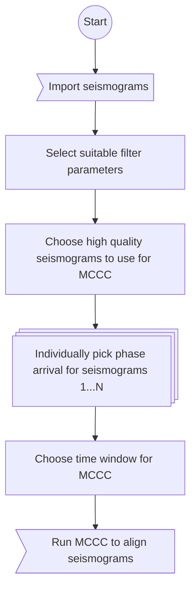
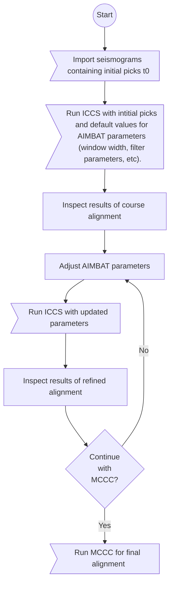
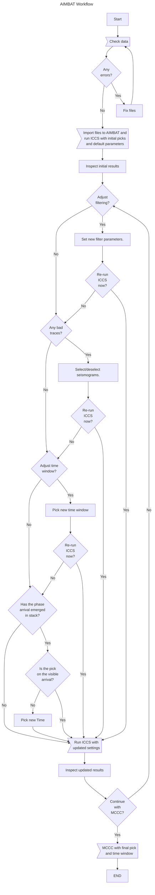

# Workflow and Strategy

## Without AIMBAT

Multi-Channel Cross-Correlation[@vandecar_determination_1990] (MCCC) relies on
narrow time windows, focused on the initial arrival arrival of the targeted
phase in order to yield high quality results. Manually picking the phase
arrival on each seismogram individually is a very time consuming task, which we
highlight with stacked cards in the below flowchart:

## With AIMBAT

AIMBAT[@lou_aimbat_2013] stacks all input seismograms (aligned on the picked
phase arrival) and operates on that stack instead of individual seismograms.
This allows picking the phase arrival once for all seismograms simultaneously,
and then improving it iteratively before running MCCC. Note that both the ICCS
algorithm, as well as adjusting AIMBAT parameters are iterative processes.

## Strategy

AIMBAT does not prescribe a single strategy for picking processing parameters.
Generally speaking, we recommend adjusting only one parameter at a time between
ICCS runs, and prioritising them as follows:

1. Filter parameters.
2. Selection of high quality seismograms.
3. Time window boundaries
4. Manually picking phase arrival.

!!! tip

    Remember that you can create snapshots of the current AIMBAT parameters at
    any time, and then rollback to that state if you notice you went into the
    wrong direction. We therefore encourage experimenting a bit with the
    strategy, as different events may require doing things slightly
    differently.

