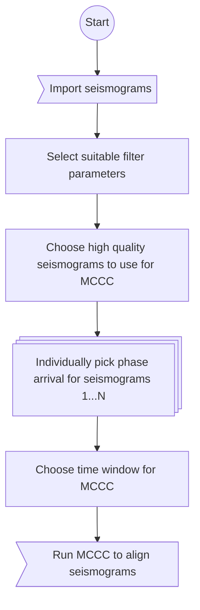
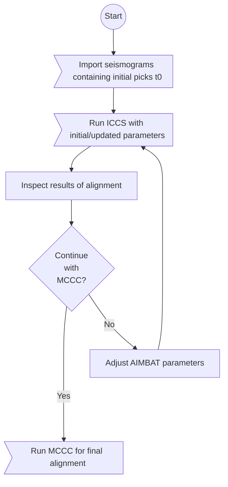

# Workflow and Strategy

## Without AIMBAT

MCCC[^1] requires narrow time windows centred on the initial phase arrival to
produce accurate results. Without a tool like AIMBAT, phase arrivals must be
picked on each seismogram individually — a time-consuming task illustrated by
the stacked steps in the flowchart below:

[^1]:
  VanDecar, J. C., and R. S. Crosson. "Determination of Teleseismic
  Relative Phase Arrival Times Using Multi-Channel Cross-Correlation and
  Least Squares." Bulletin of the Seismological Society of America,
  vol. 80, no. 1, Feb. 1990, pp. 150–69,
  <https://doi.org/10.1785/BSSA0800010150>.

```mermaid
flowchart TD
  A@{ shape: circle, label: "Start"} --> B>Import seismograms];
  B --> C[Select suitable filter parameters]
  C --> D[Choose high quality seismograms to use for MCCC]
  D --> E@{ shape: processes, label: "Individually pick phase arrival for seismograms 1...N"}
  E --> F[Choose time window for MCCC]
  F --> G>Run MCCC to align seismograms]
```

## With AIMBAT

AIMBAT[^2] stacks all seismograms aligned on an initial pick, then
cross-correlates each seismogram against that stack to refine arrivals
simultaneously across the array. Parameters and picks are improved iteratively
before a final MCCC run.

[^2]:
  Lou, X., et al. "AIMBAT: A Python/Matplotlib Tool for Measuring
  Teleseismic Arrival Times." Seismological Research Letters, vol. 84,
  no. 1, Jan. 2013, pp. 85–93, <https://doi.org/10.1785/0220120033>.

``` mermaid
flowchart TD
  A@{ shape: circle, label: "Start"}
  A --> B>Import seismograms containing initial picks t0];
  B --> F
  E[Adjust AIMBAT parameters];
  E --> F>Run ICCS with initial/updated parameters]
  F --> G[Inspect results of alignment];
  G --> H{"Continue
          with
          MCCC?"}
  H ---->|Yes| M>"Run MCCC for final alignment"];
  H -->|No| E;
```

## Strategy

1. Change one parameter at a time and run ICCS to observe the effect before
   making further adjustments.
2. Take snapshots often, with a comment describing the current state. They are
   lightweight and easy to roll back to.
3. Do not focus too much on individual poorly-aligned seismograms — use
   autoflip and autoselect to let the algorithm handle them.

### ICCS running modes

ICCS has two optional flags:

- **Autoflip**: automatically toggles the `flip` parameter for seismograms
  whose maximum absolute correlation with the stack is negative (i.e. inverted
  polarity).
- **Autoselect**: automatically sets `select=False` for seismograms poorly
  correlated with the stack, and restores them to `select=True` if they improve
  in a subsequent iteration.

The `flip` parameter controls polarity when preparing seismograms for the
stack. The `select` parameter controls whether a seismogram is included in the
stack — but *all* seismograms are cross-correlated against the stack regardless
of their `select` status. A deselected seismogram can therefore recover
automatically if parameter changes bring it into alignment.

!!! tip
    If a seismogram drifts far from the stack (large difference between initial
    and revised pick across iterations), consider deleting it from the project.
    Rogue seismograms can distort the valid ranges used when updating picks and
    time windows.
