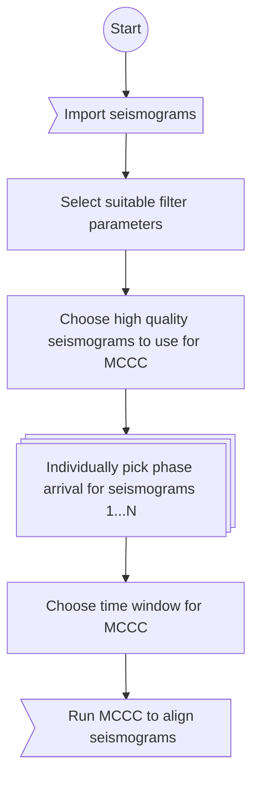
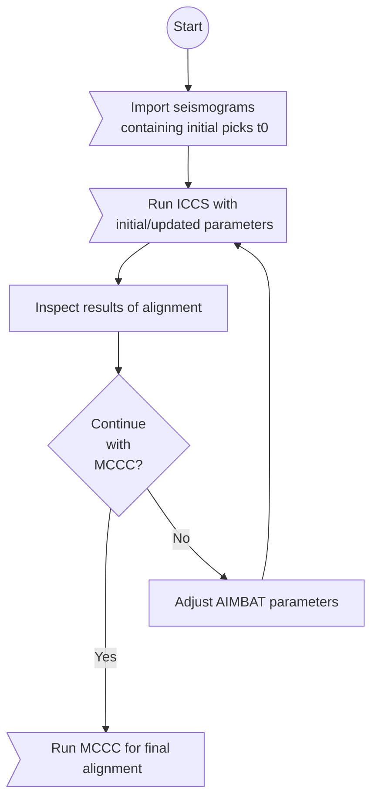

# Workflow and strategy

The AIMBAT workflow is easiest to understand next to the manual process it
replaces.

## Without AIMBAT

MCCC[^1] needs a narrow time window centred on the arrival to give accurate
results. Without a tool like AIMBAT, that means picking the phase arrival on
every seismogram by hand:

```mermaid
flowchart TD
  A@{ shape: circle, label: "Start"} --> B>Import seismograms];
  B --> C[Select suitable filter parameters]
  C --> D[Choose high quality seismograms to use for MCCC]
  D --> E@{ shape: processes, label: "Individually pick phase arrival for seismograms 1...N"}
  E --> F[Choose time window for MCCC]
  F --> G>Run MCCC to align seismograms]
```

## With AIMBAT

AIMBAT[^2] replaces the manual middle of that process with ICCS. After import,
the work is a loop: adjust parameters, run ICCS, inspect the alignment, repeat.
MCCC is an optional final pass that adds formal timing errors.

```mermaid
flowchart TD
  A@{ shape: circle, label: "Start"}
  A --> B>Import seismograms containing initial picks t0];
  B --> F
  E[Adjust AIMBAT parameters];
  E --> F>Run ICCS with initial/updated parameters]
  F --> G[Inspect results of alignment];
  G --> H{"Continue
          with
          MCCC?"}
  H ---->|Yes| M>"Run MCCC for final alignment"];
  H -->|No| E;
```

The loop is not run once. Snapshots record the state at any point, so ICCS and
MCCC can be repeated or reordered, and results exported from any snapshot.
Running MCCC before the final export is usual but not required.

## Strategy

- **Change one parameter at a time.** Run ICCS after each change to see its
    effect before adjusting anything else.
- **Snapshot often.** Snapshots are lightweight and easy to roll back to.
- **Let the algorithm handle outliers.** Use autoflip and autoselect rather than
    hand-fixing individual seismograms. Delete one that stays poorly aligned
    across many runs.
- **Export from any useful state**, not only at the end. ICCS picks are usable
    as they are; MCCC adds formal timing errors when they are needed.

!!! tip "Keep notes while working"

    Events, stations, seismograms, and snapshots can each carry a freeform
    Markdown note (`#!bash aimbat <target> note edit`). Recording what changed
    and why makes a promising snapshot easy to find again later. See
    [Notes](../usage/index.md#notes) for the shell, TUI, and API equivalents.

For the ICCS options (autoflip, autoselect) and the MCCC `--all` flag, see
[Aligning with ICCS](../usage/alignment.md) and [MCCC Alignment](../usage/mccc.md).

[^1]: VanDecar, J. C., and R. S. Crosson. "Determination of Teleseismic Relative
    Phase Arrival Times Using Multi-Channel Cross-Correlation and Least Squares."
    Bulletin of the Seismological Society of America, vol. 80, no. 1, Feb. 1990,
    pp. 150–69, <https://doi.org/10.1785/BSSA0800010150>.

[^2]: Lou, X., et al. "AIMBAT: A Python/Matplotlib Tool for Measuring Teleseismic
    Arrival Times." Seismological Research Letters, vol. 84, no. 1, Jan. 2013,
    pp. 85–93, <https://doi.org/10.1785/0220120033>.
