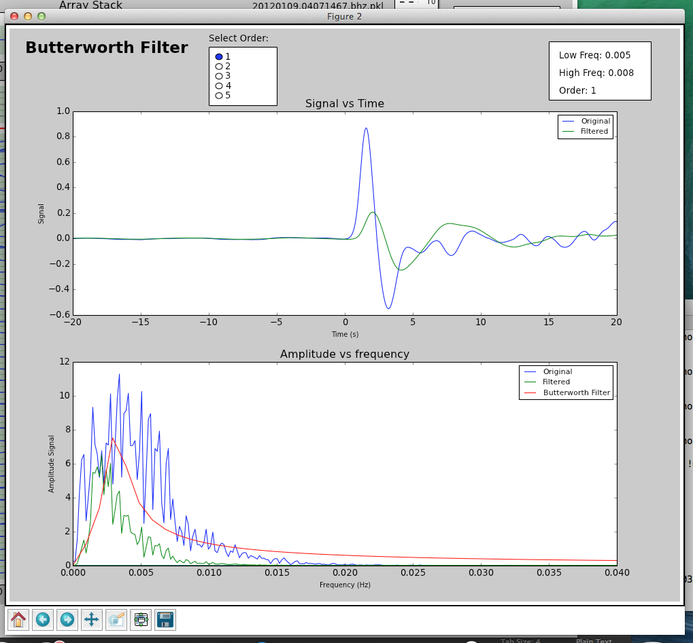
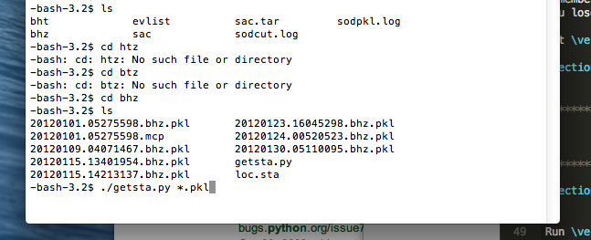

=============================================
Measuring Teleseismic Body Wave Arrival Times
=============================================

The core idea in using AIMBAT to measure teleseismic body wave arrival times has two parts:

* automated phase alignment, to reduce user processing time, and
* interactive quality control, to retain valuable user inputs.

.. ############################################################################ ..
.. #                           AUTOMATED PHASE ALIGNMENT                      # ..
.. ############################################################################ ..

Automated Phase Alignment
-------------------------

The ICCS algorithm calculates an array stack from predicted time picks, cross-correlates each seismogram with the array stack to find the time lags at maximum cross-correlation, then uses the new time picks to update the array stack in an iterative process. The MCCC algorithm cross-correlates each possible pair of seismograms and uses a least-squares method to calculate an optimized set of relative arrival times. Our method combines ICCS and MCCC in a four-step procedure using four anchoring time picks :math:`_0T_i,\,_1T_i,\,_2T_i,` and :math:`_3T_i`.

(a) Coarse alignment by ICCS
(b) Pick phase arrival at the array stack
(c) Refined alignment by ICCS
(d) Final alignment by MCCC

The one-time manual phase picking at the array stack in step (b) allows the measurement of absolute arrival times. The detailed methodology and procedure can be found in [LouVanDerLee2013]_.

.. table:: Time picks and their SAC headers used in the procedure for measuring teleseismic body wave arrival times.

	+------+-----------+-------------+----------------+-------------+---------------+-------------+
	| Step | Algorithm |                    Input                   |            Output           |
	+      +           +-------------+----------------+-------------+---------------+-------------+
	|      |           | Time Window | Time Pick      | Time Header | Time Pick     | Time Header |
	+------+-----------+-------------+----------------+-------------+---------------+-------------+
	| (a)  |   ICCS    | :math:`W_a` | :math:`_0T_i`  | **T0**      | :math:`_1T_i` | **T1**      |
	+------+-----------+-------------+----------------+-------------+---------------+-------------+
	| (b)  |   ICCS    | :math:`W_b` | :math:`_2T'_i` | **T2**      | :math:`_2T_i` | **T2**      |
	+------+-----------+-------------+----------------+-------------+---------------+-------------+
	| (d)  |   MCCS    | :math:`W_b` | :math:`_2T_i`  | **T2**      | :math:`_3T_i` | **T3**      |
	+------+-----------+-------------+----------------+-------------+---------------+-------------+

The ICCS and MCCC algorithms are implemented in two modules ``pysmo.aimbat.algiccs`` and ``pysmo.aimbat.algmccc``, and can be executed in scripts ``iccs.py`` and ``mccc.py`` respectively.

.. ############################################################################ ..
.. #                           AUTOMATED PHASE ALIGNMENT                      # ..
.. ############################################################################ ..

.. ############################################################################ ..
.. #                             PICKING TRAVEL TIMES                         # ..
.. ############################################################################ ..

Picking Travel Times
--------------------

This section explains how to run the program :code:`ttpick.py` to get the travel times you want.

.. ----------------------------------------------------------------------------- ..

Getting into the right directory
~~~~~~~~~~~~~~~~~~~~~~~~~~~~~~~~

In the terminal, cd into the directory with all of the ``pkl`` files you want to run. You want to run either the ``BHT`` or ``BHZ`` files. ``BHT`` files are for S-waves and ``BHZ`` files are for P-waves. ``PKL`` is a bundle of ``SAC`` files. Each ``SAC`` file is a seismogram, but since there may be many seismograms from various stations for each event, we bundle them into a ``PKL`` file so we only have to import one file into AIMBAT, not a few hundred of them.

.. ----------------------------------------------------------------------------- ..

Running ttpick.py
~~~~~~~~~~~~~~~~~

Run ``ttpick.py -p P <path-to-pkl-file>`` for ``BHZ`` files or ``ttpick.py -p S <path-to-pkl-file>`` for ``BHT`` files. A GUI should pop up if you successfully ran it. Note that if you click on the buttons, they will not work until you move your mouse off them; this is a problem we are hoping to fix.

You can get some example data to test this out by downloading the Github repository `data-example <https://github.com/pysmo/data-example>`_. Now, cd into the folder `example_pkl_files`, which has several pickle files for seismic events. Type::

    ttpick.py -p P 20110915.19310408.bhz.pkl

and a python GUI should pop up.

.. image:: pickingTravelTimes-images/pick_travel_times.png

At the top of the GUI is the scaled sum of all of the seismograms known as the array stack, which gives a characteristic waveform of the event for the stations involved. Beneath this is a page of seismograms, with the corresponding station and various quality factors listed on the right. ``CCC`` is the cross-correlation coefficient between that seismogram and the array stack, ``SNR`` is the signal-to-noise ratio, and ``COH`` is the coherence between that seismogram and the array stack.

.. ----------------------------------------------------------------------------- ..

Initial deselection of bad seismograms
~~~~~~~~~~~~~~~~~~~~~~~~~~~~~~~~~~~~~~

Bad seismograms are those whose waveforms look nothing like the array stack above. By default, the seismograms are sorted by quality, so bad seismograms will likely be at the top. In order to deselect these, click on the waveforms themselves (not the fill) and wait a second or two for them to turn gray. The user can develop criteria for which seismograms to deselect and which to keep. Simply deselecting all seismograms below a certain quality threshold can decrease time but may lead to good seismograms being deselected or bad seismograms remaining.

Remember to save your work periodically once you start picking your travel times. Otherwise, if AIMBAT crashes, you will lose your work.

Align
~~~~~

The first step after deselecting seismograms is to press ``Align``. This will recalculate both the array stack and the T1 picks for the seismograms, not including the deselected seismograms. Do not press ``Align`` after pressing ``Sync`` unless you wish to remove any ``T2`` picks that have been made.

.. ----------------------------------------------------------------------------- ..

Sync, refine, and setting time window
~~~~~~~~~~~~~~~~~~~~~~~~~~~~~~~~~~~~~

After hitting the ``Align`` button, place the cursor on the array stack where the first motion of the seismogram, either up or down, occurs. Press ``t`` and ``2`` simultaneously on the keyboard to select the arrival time. Now press ``Sync``. Use the mouse to drag and select the desired time window on the seismogram on the array stack. This time window is the portion of the seismogram on which cross-correlation will be run. The time window should begin 2-10 seconds before the first arrival and include a few seconds of the first motion of the waveform. The final time window should be smaller than the default window to increase the accuracy of the cross-correlation.

.. image:: pickingTravelTimes-images/selecting-time-window-highlight.png

Next, set the cursor over the array stack and press the ``w`` key. If the new time window has been saved, a message noting the new size of the time window will be printed in the terminal. The entire width of the x-axis is now colored green and will be stored as the time window to use for the cross-correlations. Press ``Save headers only`` if you wish to keep this time window for future applications.

Now press ``Refine`` and all the seismograms will align with the smaller time window. Note that the ``Weighted average quality`` printed to the terminal may decrease significantly, but this is likely due to the fact that the time window is smaller than the original.

.. ----------------------------------------------------------------------------- ..

Filtering
~~~~~~~~~

If you wish to apply a filter to your data, hit the ``Filter`` button, and a window will pop up for you to use the `Butterworth filter <http://en.wikipedia.org/wiki/Butterworth_filter>`_ to filter your data.

The defaults used for filtering are:

+----------------+----------+
| Variable       | Default  |
+================+==========+
| Order          | 2        |
+----------------+----------+
| Filter Type    | Bandpass |
+----------------+----------+
| Low Frequency  | 0.05 Hz  |
+----------------+----------+
| High Frequency | 0.25 Hz  |
+----------------+----------+

You can change the order and filter type by selecting the option you want. In order to set corner frequencies for the filter, select the low frequency and the high frequency you want on the lower figure by clicking. Press ``Apply`` to filter the seismograms when you are satisfied with the filter parameters chosen.

.. ----------------------------------------------------------------------------- ..

Finalize
~~~~~~~~

Hit ``Finalize`` to run the multi-channel cross-correlation. Do not hit ``Align`` or ``Refine`` again, or all your previous picks will be written over. A warning will pop up to check if you really do want to hit these two buttons if you do click on them.

.. ----------------------------------------------------------------------------- ..

SACP2 to check for outlier seismograms
~~~~~~~~~~~~~~~~~~~~~~~~~~~~~~~~~~~~~~

Hit ``SACP2`` and go to the last figure, (d). Zoom in to have a better look. Zooming in doesn’t always work well; close and reopen the ``SACP2`` window if there are problems.

Click on the outliers that stray from the main group of stacked seismograms. The terminal will output the names of the seismograms that you clicked on, so you can return to the main GUI window and readjust the travel times. Note: hitting ``SACP2`` before hitting ``Finalize`` will often cause AIMBAT to close, so make sure you have finalized before using SACP2.

.. image:: pickingTravelTimes-images/SACP2_popup.png

.. ----------------------------------------------------------------------------- ..

Go through the badly aligned seismograms and realign the travel times manually
~~~~~~~~~~~~~~~~~~~~~~~~~~~~~~~~~~~~~~~~~~~~~~~~~~~~~~~~~~~~~~~~~~~~~~~~~~~~~~

By default, the worst seismograms are on the first page, and as you click through the pages, the quality of the seismograms gradually gets better. Keep using ``t2`` to realign the arrival times so that the peaks of all the seismograms are nicely aligned. Remember to zoom in to have a better look.

However, you may wish to sort the seismograms in alphabetical order or by azimuth so that you can find the bad seismogrrams and correct them more easily. Hit the ``Sort`` button and a window will pop up for you to choose which sorting method to use. In this case, choose ``File`` to sort the files by station name alphabetically, or choose ``AZ`` to sort the files by azimuth from the event epicenter. The seismograms are stretched to fit together, but they may be scaled differently.

.. ############################################################################ ..
.. #                             PICKING TRAVEL TIMES                         # ..
.. ############################################################################ ..

.. ############################################################################ ..
.. #                            ALIGNMENTS SUMMARY                            # ..
.. ############################################################################ ..

What the Alignments Stand For
-----------------------------

* T0: Theoretical Arrival
* T1: Pick from initial cross correlation
* T2: Travel Time pick
* T3: MCCC pick
* T4: Zoom in

.. ############################################################################ ..
.. #                            ALIGNMENTS SUMMARY                            # ..
.. ############################################################################ ..

.. ############################################################################ ..
.. #                              POST PROCESSING                             # ..
.. ############################################################################ ..

Post Processing
---------------

.. ----------------------------------------------------------------------------- ..

Getting the output
~~~~~~~~~~~~~~~~~~

In the same folder as the initial PKL file you ran ``ttpick.py`` on, you can find the output list with extension ``<event name>.mcp``, which contains the travel time arrivals.

.. image:: pickingTravelTimes-images/output_list.png

``mccc delay`` is `t3+average arrival times`, and `t0_times` are the theoretical arrival times. `delay_times` are obtained by taking `t3-t0`.

Disclaimer about delay times
~~~~~~~~~~~~~~~~~~~~~~~~~~~~

`t0` depends on hypocenter location, origin time, and reference model. We compute the delay time by finding `t3-t0`, but it does not have elliptic, topological, or crust corrections.

.. ----------------------------------------------------------------------------- ..

Getting the stations of the seismograms chosen
~~~~~~~~~~~~~~~~~~~~~~~~~~~~~~~~~~~~~~~~~~~~~~

Run ``getsta.py`` in the additional scripts (not on Github for now). It gives the unique list of stations where the seismograms came from. You need to run it with the list of all ``pkl`` files chosen after you saved to. To do this, type ``./getsta.py *.pkl``.

.. ############################################################################ ..
.. #                              POST PROCESSING                             # ..
.. ############################################################################ ..

.. ############################################################################ ..
.. #                              POSSIBLE ISSUES                             # ..
.. ############################################################################ ..

Picking Travel Times does not work
~~~~~~~~~~~~~~~~~~~~~~~~~~~~~~~~~~

If you run ``ttick.py <Event name>.bhz.pkl``, a GUI will pop up for you to manually pick the travel times by pressing the keyboard. If typing on the keyboard as directed does not allow you to pick travel times, it could be a problem with the keyboard settings, or the matplotlib backend.

To fix this, first look for the .matplotlib directory. It is hidden in your home directory, so do ``ls -a`` to find it.

Once you have found the ``.matplotlib`` directory, cd into it, and then look for the ``matplotlibrc`` file.
Inside that file, ensure the backend is set to::

  	backend : TkAgg

Make sure to comment out the other backends.

.. ############################################################################ ..
.. #                              POSSIBLE ISSUES                             # ..
.. ############################################################################ ..
