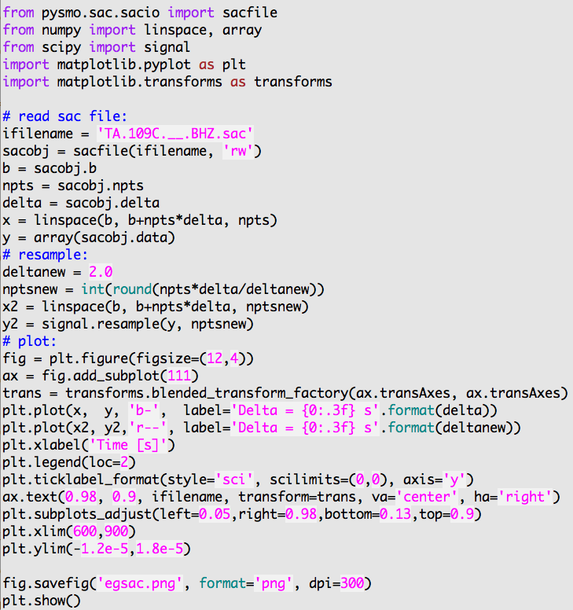
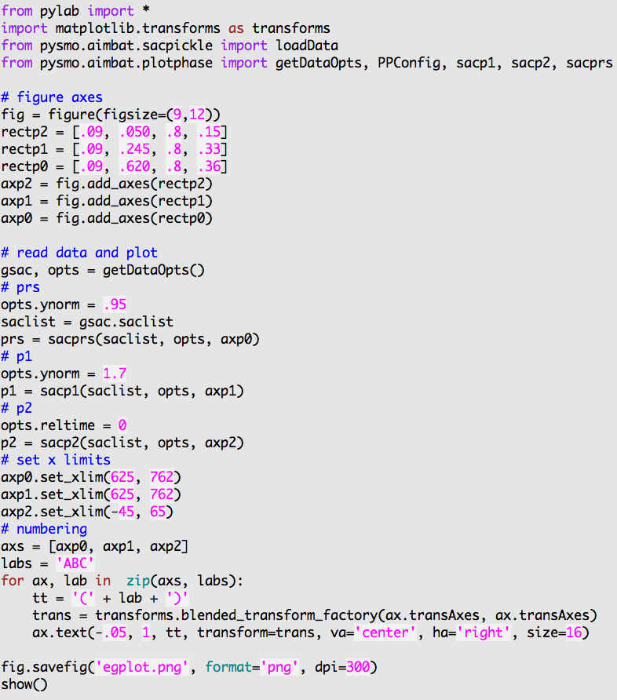
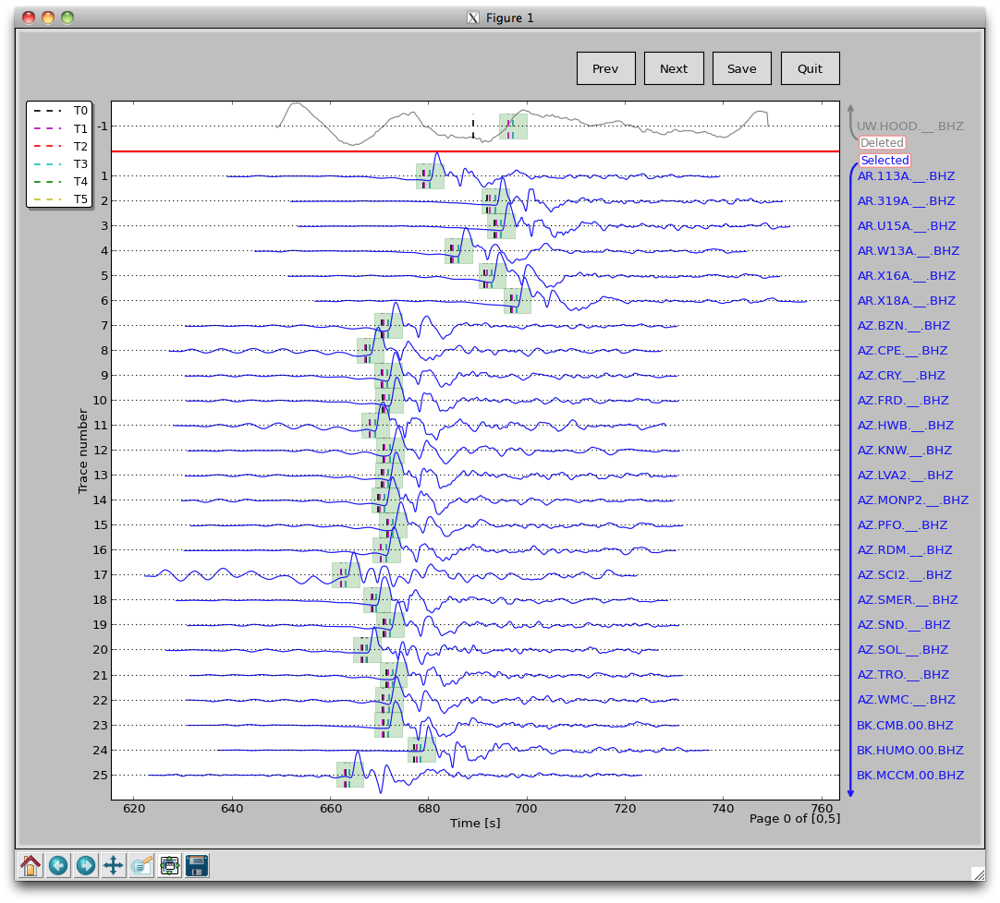

===============
SAC Data Access
===============

NOTE: All ``.sac`` files must include origin time, hypocenter, as well as station coordinates and elevation in their headers.

.. ############################################################################ ..
.. #                         PYTHON OBJECT FOR SAC FILE                       # ..
.. ############################################################################ ..

Python Object for SAC File
--------------------------

The ``pysmo.sac`` package is developed to read and write individual SAC files.
The Python class ``sacfile`` of module ``sacio`` opens a SAC file and returns an object including data and all SAC header variables as their attributes. Modifications of object attributes are saved to file. It is written purely in Python so that it also runs with `Jython <http://www.jython.org>`_.
  	
`egsac.py`
~~~~~~~~~~

The ``<pkg-install-dir>/aimbat/scripts/egsac.py`` script gives a simple example to read, resample, and plot a seismogram using pysmo, Scipy, and Matplotlib. You can type the codes in a Python/iPython shell, or run as a script in the data example directory ``<pkg-install-dir>/data-example/example_pkl_files/Event_2011.09.15.19.31.04.080``, hereafter referred to as `<example-event-dir>`.

Resampling Seismograms
~~~~~~~~~~~~~~~~~~~~~~

In this example, a SAC file named ``TA.109C.\_\_.BHZ.sac`` is read in as a sacfile object. The time array is calculated from SAC headers.  The data array is resampled from interval 0.025 to 2.0 seconds using Scipy's signalprocessing module.

Add the following codes to write the resampled seismogram to file ``TA.109C.\_\_.BHZ.sac``::

	sacobj.delta = deltanew
	sacobj.npts = nptsnew
	sacobj.data = y2

.. image:: SACdataAccess/egsac-109c.png

.. ############################################################################ ..
.. #                         PYTHON OBJECT FOR SAC FILE                       # ..
.. ############################################################################ ..

.. ############################################################################ ..
.. #                        PYTHON PICKLE FOR SAC FILES                       # ..
.. ############################################################################ ..

Python Pickle for SAC Files
---------------------------

The ``pysmo.sacio`` module converts SAC files to ``sacfile`` objects. Any modification of the objects are instantly written to files. In data processing, the user may want to abandon changes made earlier, which brings the need of a buffer for the ``sacfile`` objects.

The ``SacDataHdrs`` class in the ``pysmo.aimbat.sacpickle`` module is written on top of ``pysmo.sacio`` to serves this purpose by reading a SAC file and returning a ``sacdh`` object that is very similar to the ``sacfile`` object. Essentially, the ``sacdh`` object is a copy of the ``sacfile`` object in the memory, except that SAC headers 't0-t9', 'user0-user9', and 'kuser0-kuser2' are saved in three Python lists.

A ``gsac`` object of the ``SacGroup`` class consists of a group of ``sacdh`` objects from event-based SAC data files, earthquake hypocenter information, and station locations.
An additional step is required to save changes in the ``gsac`` object to files.

In order to avoid frequent SAC file I/O, the ``pickle/cPickle`` module is used for serializing and de-serializing the ``gsac`` object structure. Thus the data processing efficiency is improved because reading and writing of SAC files are done only once each before and after data processing. Script ``sac2pkl.py`` does the conversions between SAC files and Python pickles. 

Its usage message can be printed out by running at command line::

	sac2pkl.py -h

and the result is displayed in the figure below. For example, in the data example directory ``<example-event-dir>``, run::

	sac2pkl.py -s *Z -o 20110915.19310408.bhz.pkl -d 0.025

to read 163 vertical component seismograms at a sample interval of 0.025 s and convert to a ``gsac`` object, which is saved in the pickle file ``20110915.19310408.bhz.pkl``.

To save disk space, compressed pickle files in ``gz`` and ``bz2`` formats can be generated by::

	sac2pkl.py -s *Z -o 20110915.19310408.bhz.pkl -d 0.025 -z gz
	sac2pkl.py -s *Z -o 20110915.19310408.bhz.pkl -d 0.025 -z bz2

at the cost of more CPU time.

After processing, run::

	sac2pkl.py 20110915.19310408.bhz.pkl -p

to convert the pickle file to SAC files.

.. image:: SACdataAccess/help-sac2pkl.png

See the doc string of ``pysmo.aimbat.sacpickle`` by typing in a python console::

	from pysmo.aimbat import sacpickle
	print sacpickle.\_\_doc\_\_
 
and also the documentation on `pickle <http://docs.python.org/library/pickle.html>`_ for more information about the Python data structure, pickling, and unpickling.

.. ############################################################################ ..
.. #                        PYTHON PICKLE FOR SAC FILES                       # ..
.. ############################################################################ ..

.. ############################################################################ ..
.. #                        SAC PLOTTING AND PHASE PICKING                    # ..
.. ############################################################################ ..

SAC Plotting and Phase Picking
------------------------------

.. image:: SACdataAccess/help-sacplot.png

SAC plotting and phase picking functionalities are replicated and enhanced based on the GUI neutral widgets (such as Button and SpanSelector) and the event (keyboard and mouse events such as ``key\_press\_event`` and ``mouse\_motion\_event`` handling API of Matplotlib.

They are implemented in two modules, ``pysmo.aimbat.plotphase`` and ``pysmo.aimbat.pickphase``, which are used by corresponding scripts ``sacplot.py`` and ``sacppk.py`` executable at command line. Their help messages are displayed in the figures below.

.. image:: SACdataAccess/help-sacppk.png

SAC Plotting
~~~~~~~~~~~~

Options "-i, -z, -d, -a, and -b" of ``sacplot.py`` set the seismogram plotting baseline as file index, zero, epicentral distance in degrees, azimuth, and back-azimuth, respectively. 
The user can run ``sacplot.py`` directly with the options, or run individual scripts
``sacp1.py``, ``sacp2.py``, ``sacprs.py``, ``sacpaz.py``, and ``sacpbaz.py``, which preset the baseline options and plot seismograms in SAC p1 style, p2 style, record section, and relative to azimuth and back-azimuth. The following commands are equivalent::

	sacplot.py -i, sacp1.py
	sacplot.py -z, sacp2.py
	sacplot.py -d, sacprs.py
	sacplot.py -a, sacpaz.py
	sacplot.py -b, sacpbaz.py

Input data files need to be supplied to the scripts in the form of either a list of SAC files or a pickle file that includes multiple SAC files. For example, a ``bhz.pkl`` file is generated from 22 vertical component seismograms ``TA.[1-K]*Z`` by running::

	sac2pkl.py TA.[1-K]*BHZ -o bhz.pkl -d0.025

in the data example directory ``<example-event-dir>``. Then the two commands are equivalent::

	sacp1.py TA.[1-K]*Z

or::

	sacp1.py bhz.pkl

For large numbers of seismograms, the pickle file is suggested because of faster loading.

Besides using the standard ``sacplot.py`` script, the user can modify its ``getAxes`` function in their own script to customize figure size and axes attributes. Script ``egplot.py`` is such an example in which SAC p1, p2 styles and record section plotting are drawn in three axes in the same figure canvas. Run::

	egplot.py TA.[1-K]*Z  -f1 -C

at command line to produce the figure below.

.. image:: SACdataAccess/egplot.png

The "-C" option uses random color for each seismogram.
The "-f1" option fills the positive signals of waveform with less transparency.  
In the script, "opts.ynorm" sets the waveform normalization and "opts.reltime=0" sets the time axis relative to time pick t0.

An improvement over SAC is that the program outputs the filename when the seismogram is clicked on by the mouse. This is enabled by the event handling API and is mostly introduced for use in SAC p2 style plotting when seismograms are plotted on top of each other. It is especially useful when a large number of seismograms create difficulties in labeling.

Another improvement is easier window zooming enabled by the SpanSelector widget and the event handling API. Select a time span by mouse clicking and dragging to zoom in a waveform section.
Press the 'z' key to zoom out to the previous time range.

.. ############################################################################ ..
.. #                        SAC PLOTTING AND PHASE PICKING                    # ..
.. ############################################################################ ..

.. ############################################################################ ..
.. #                              SAC PHASE PICKING                           # ..
.. ############################################################################ ..

SAC Phase Picking
-----------------

SAC plotting (``pysmo.aimbat.plotphase``) does not involve change in data files, but phase picking (``pysmo.aimbat.pickphase``) does. A GUI is built for the user to interactively pick phase arrival times. The figure below is an example screen shot running::

	sacppk.py 20110915.19310408.bhz.pkl -w

in the data example directory ``<example-event-dir>``.

Following SAC convention, the user can set a time pick by pressing the 't' key and number keys '0-9'. The x location of the mouse position is saved to corresponding SAC headers 't0-t9'. 
Time window zooming in ``pysmo.aimbat.pickphase`` is implemented in the same way as in ``pysmo.aimbat.plotphase`` to replace SAC's combination of the 'x' key and mouse click. 
Zooming out key is set to 'z' because the 'o' key is used for another purpose by Matplotlib.
The filename printing out by mouse clicking feature is also available in ``pysmo.aimbat.pickphase``.

A major improvement over SAC is picking a time window in addition to time picks.
Pressing the 'w' key to save the current time axis range to two user-defined SAC header variables. A transparent green span is plotted within the time window, as shown in the figure below.

Another major improvement involves quality control with convenient operations to (de)select seismograms. In the GUI above, there are two divisions of selected and deleted seismograms. 
Selected seismograms with a positive trace number are displayed with blue wiggles, while deleted seismograms with negative trace numbers are plotted in gray. The user can simply click on a certain seismogram to switch the selection status, either to exclude it or bring it back for inclusion. The trace selection status is stored in a user-defined SAC header variable.

In SAC, command ``ppk p 10`` plots 10 seismograms on each page. Pressing the 'b' and 'n' keys to navigate through pages. The number of seismograms plotted on each page is controlled by command line option::

	-m maxsel maxdel 

for ``sacppk.py``. The ``Prev`` and ``Next`` buttons are for page navigation and the ``Save`` Button saves the change in time picks and time window to files. The default values for maxsel and maxdel are 25 and 5, which means a maximum of 30 seismograms on each page. 

In the figure displayed, there are 26 seismograms on the first page because only 1 seismogram is deleted. On the next page, there are 30 selected seismograms. To plot 50 seismograms on each page, run::

	sacppk.py 20110915.19310408.bhz.pkl -w -m 45 5

and there would be 4 total pages and 13 seismograms on the last page.

To plot seismograms relative to time pick t0 and fill the positive and negative wiggles of waveform, run::

	sacppk.py 20110915.19310408.bhz.pkl -w -r0 -f1

To sort seismograms by epicentral distance in increase and decrease orders, run::

	sacppk.py 20110915.19310408.bhz.pkl -w -sdist
	sacppk.py 20110915.19310408.bhz.pkl -w -sdist-

Sorting by azimuth and back-azimuth is similar::

	sacppk.py 20110915.19310408.bhz.pkl -w -saz
	sacppk.py 20110915.19310408.bhz.pkl -w -sbaz

The help message of the ``iccs.py`` script is shown below:

.. image:: SACdataAccess/help-iccs.png

The help message of the ``mccs.py`` script is shown below:

.. image:: SACdataAccess/help-mccc.png

.. ############################################################################ ..
.. #                              SAC PHASE PICKING                           # ..
.. ############################################################################ ..

