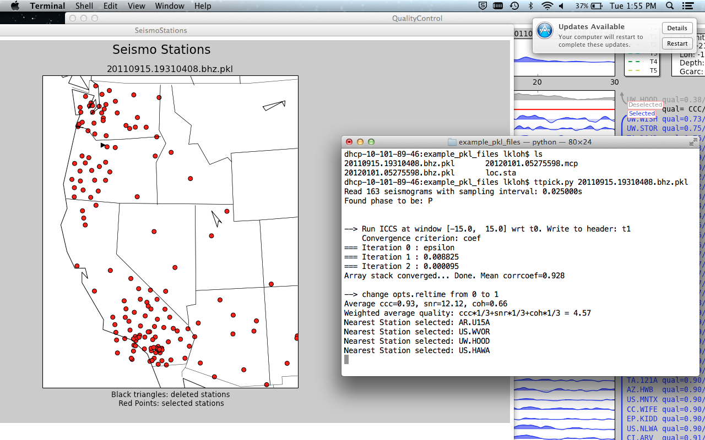

=============================
Visualizing Stations on a map
=============================

After running::

	ttpick.py <sac-files>

Hit ``Map of Stations`` in order to get a visual respresentation of where exactly each station is. Dots represent circles used for computing delay times; black triangles represent discarded stations. Click on a dot to get the station name in the terminal.

