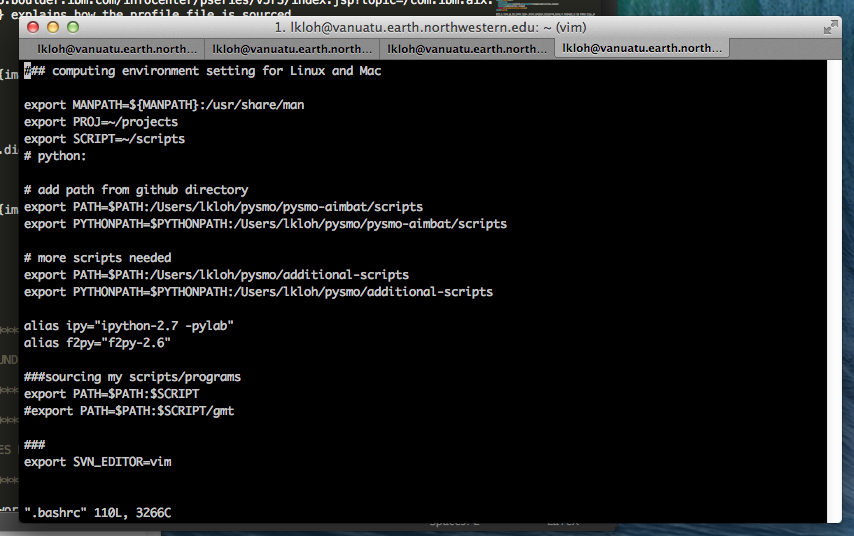

=======================
Installing Dependencies
=======================

AIMBAT is built on top of `standard Python <https://www.python.org/>`_ and uses several extra Python libraries as well. This page guides the user through checking if the required libraries are already installed on the computer they want to install AIMBAT on, and how to get them if not.

To install AIMBAT, you will need sudo/root privileges for the computer you are installing it on.

.. ############################################################################ ..
.. #                              OPERATING SYSTEM                            # ..
.. ############################################################################ ..

Getting your operating system
-----------------------------

We assume that most users of AIMBAT will be using Macs. If our assumptions are wrong, please :ref:`contact the authors <authors-contacts>`, and if there is sufficient interest we will test and write documentation for installations on other operating systems as well.

On a Mac, to find the version of your operating system, first click on the Apple icon on the top bar of your desktop, go to ``System Preferences``, and click on ``Startup Disk``. The operating system version should then be displayed.

.. image:: installing-images/system_preferences.png

.. ############################################################################ ..
.. #                              OPERATING SYSTEM                            # ..
.. ############################################################################ ..

.. ############################################################################ ..
.. #                                 GITHUB                                   # ..
.. ############################################################################ ..

Github
------

`Optional`

The `latest version of AIMBAT <https://github.com/pysmo>`_ will be on `Github <https://github.com/>`_, so it would be good to get `Git <https://github.com/>`_ on your computer. This is not strictly necessary, as you could also download it as a zipfile from the `AIMBAT website <http://www.earth.northwestern.edu/~xlou/aimbat.html>`_.

To check if you already have `Git <https://github.com/>`_ installed, open the terminal and type::

  git --version

If Git is installed, the terminal should output a line describing the version number of Git installed on the computer, such as::

  git version 1.8.5.2 (Apple Git-48)

If Git is not installed, the terminal will respond by telling you that it is not possible to issue this command::

  -bash: git: command not found

To install Git, download the package installer `here <http://git-scm.com/download/mac>`_. This would allow only command line usage of Git, so if you want to use a GUI, we recommend `Git for Mac <https://mac.github.com/>`_.

.. ############################################################################ ..
.. #                                 GITHUB                                   # ..
.. ############################################################################ ..

.. ############################################################################ ..
.. #                                 MACPORTS                                 # ..
.. ############################################################################ ..

MacPorts
--------

`Highly recommended`

`MacPorts <http://www.macports.org/>`_ is a package management system that will be very helpful to install some python libraries.

To check if MacPorts is installed already, in the terminal, type::

  port version

If MacPorts is installed, you should see the terminal output the version number, for instance::

  Version: 2.3.0

If MacPorts is not installed, you should see the terminal output that ``port`` is not a valid command::

  -bash: port: command not found

To get MacPorts, download the package installer `here <http://www.macports.org/install.php>`_ and follow the instructions to install it. Be sure to get the right version of MacPorts for your operating system.

.. ############################################################################ ..
.. #                                 MACPORTS                                 # ..
.. ############################################################################ ..

.. ############################################################################ ..
.. #                            PYTHON DEPENDENCIES                           # ..
.. ############################################################################ ..

Python and its Dependencies
---------------------------

AIMBAT requires python 2.7 and above to run. Note that Python is usually installed by default on Mac computers.

AIMBAT requires the following packages to run:

#. `Numpy <http://www.numpy.org/>`_: Used for manipulating numbers and datasets
#. `Scipy <http://www.scipy.org/>`_: Used for data processing
#. `Matplotlib <http://matplotlib.org/>`_: Used for the majority of the plots in AIMBAT and the GUI
#. `Basemap <http://matplotlib.org/basemap/>`_: Used for plotting world maps

Checking if Python is installed
~~~~~~~~~~~~~~~~~~~~~~~~~~~~~~~

Open the terminal and type::

  python --version

If Python is installed, the terminal will output the version number installed, for example::

  Python 2.7.8

If Python is not installed, the terminal will output::

  -bash: python: command not found

If Python is not installed
~~~~~~~~~~~~~~~~~~~~~~~~~~

Inside the terminal, once python is installed, type these commands in using sudo mode. Note you will need to enter your admin password::

  sudo port install py27
  sudo port install py27-numpy
  sudo port install py27-scipy
  sudo port install py27-matplotlib
  sudo port install py27-matplotlib-basemap
  sudo port install py27-ipython
  sudo port install python_select

Installing the last two packages is optional. ``ipython`` is an enhanced interactive python shell. ``python_select`` is used to select default Python version by the following command::

  port select --set python python27

If Python is already installed
~~~~~~~~~~~~~~~~~~~~~~~~~~~~~~

If Python is already installed, first check if you have the four required dependencies. Open up the Python console by typing::

  python

in the terminal. You should see something like this as output::

  Python 2.7.8 (default, Oct  3 2014, 02:34:26)
  [GCC 4.2.1 Compatible Apple LLVM 5.1 (clang-503.0.40)] on darwin
  Type "help", "copyright", "credits" or "license" for more information.
  >>>

Now, check if the packages have been installed properly by typing the following in::

  import numpy
  import scipy
  import matplotlib
  from mpl_toolkits.basemap import Basemap

If any of the packages are missing (e.g. scipy not installed), the python console will output an error. For instance::

  Traceback (most recent call last):
  File "<stdin>", line 1, in <module>
  ImportError: No module named scipy

Otherwise, the python console will simply show that it is ready for the next command.

If any of the packages are missing, you can choose to install it by whatever means you are most comfortable with. We provide one possible way to do so using MacPorts below. In the terminal, type::

  sudo port install py27

to get the python version installed in ``opt/local/bin`` where MacPorts installs everything. Select to use this version of Python by typing::

  sudo port install python_select

Now, install the missing packages by doing::

  sudo port install py27-numpy
  sudo port install py27-scipy
  sudo port install py27-matplotlib
  sudo port install py27-matplotlib-basemap

.. ############################################################################ ..
.. #                       INSTALLING BASIC PYTHON PACKAGES                   # ..
.. ############################################################################ ..

.. ############################################################################ ..
.. #                           INSTALLING BASEMAP                             # ..
.. ############################################################################ ..

Installing Basemap without MacPorts
-----------------------------------

If you have already installed Basemap, which means that::

  from mpl_toolkits.basemap import Basemap

comes out without an error in the Python console, you can skip this section. This is for users who do not want to use the MacPorts version of Python which has been installed to ``/opt/local/bin``. We anticipate that users who installed the official version of Python from the `Python website <https://www.python.org/>`_ may possible find this section useful.

Enthought Python (aka Canopy) should get you most of the dependencies needed, and should be downloaded `here <https://store.enthought.com/downloads/#default>`_. You do need to get `Geos <http://trac.osgeo.org/geos/>`_ though. The best way to get it is `install Homebrew <http://matthewcarriere.com/2013/08/05/how-to-install-and-use-homebrew/>`_, and then install ``gdal``, a package that has ``Geos`` as a dependency. To get ``gdal``, do::

  brew install gdal

Now install Basemap. Download it `here <https://pypi.python.org/pypi/basemap>`_. Unzip the package, cd into the unzipped package and run::

  sudo python setup.py build
  sudo python setup.py install

To check it worked, at the terminal, run::

  python

and then::

  from mpl_toolkits.basemap import Basemap

If installed correctly, no errors will occur.

.. ############################################################################ ..
.. #                           INSTALLING BASEMAP                             # ..
.. ############################################################################ ..

.. ############################################################################ ..
.. #                                 GFORTRAN                                 # ..
.. ############################################################################ ..

Fortran
-------

GFortran must be installed for AIMBAT. Note that f90 or f77 are also acceptable.

To check if you already have GFortran, in the terminal type::

  gfortran --version

which will print out the version number you have if it is already installed.

If GFortran is not installed, the terminal will respond with::

  -bash: gfortran: command not found

GFortran is available `here <https://gcc.gnu.org/wiki/GFortranBinaries>`_. Be sure to get the correct version for your operating system.

.. ############################################################################ ..
.. #                                 GFORTRAN                                 # ..
.. ############################################################################ ..

.. ############################################################################ ..
.. #                              POSSIBLE ISSUES                             # ..
.. ############################################################################ ..

Possible Issues
---------------

Here some common problems and possible resolutions. If your problem is not listed here, or you have a suggestion, please :ref:`contact the authors <authors-contacts>`.

.. -------------------------------------------------------------------------------- ..

Macports
~~~~~~~~

Many of the issues encountered can be solved by upgrading all Python directories on your computer using MacPorts. To do this, in the command line type::

    sudo port selfupdate
    sudo port upgrade outdated

This will first make sure your version of MacPorts is the most recent version, and will then go through all Python libraries to make sure they are all upgraded. Be aware that this step can take upwards of an hour depending on how many Python libraries you have installed and when they were last updated. If at any point a library fails to install, type::

    sudo port clean <library>
    sudo port install <library>

For example, if the library ``libcaca`` outputs an error, type::

    sudo port clean libcaca
    sudo port install libcaca

You can then simply retype ``sudo port upgrade outdated`` and it will continue with the upgrade where it left off.

If this last step does not work (i.e. it still outputs an error), type ``sudo port -p upgrade outdated``, which will ignore any errors the upgrade runs into and simply continue through the process. It is likely that these ignored errors will not have any effect on AIMBAT itself.

You may also run into problems with AIMBAT if your `Macport <http://www.macports.org/>`_ version is not compatible with your operating system version. For example, if you used Macports for OS X 10.8 to install AIMBAT, then upgraded your operating system or OS X 10.9, you may find that AIMBAT no longer works properly. You will need to upgrade Macports to fix this error.

Do not uninstall MacPorts unless you know what you are doing. Uninstalling MacPorts may get rid of other programs you installed using MacPorts. However, if you are sure you want to do so, see `here <https://guide.macports.org/chunked/installing.macports.uninstalling.html>`_ for instructions.

.. -------------------------------------------------------------------------------- ..

Installing Python with Pip
~~~~~~~~~~~~~~~~~~~~~~~~~~

Be careful with the operating system. For OS X 10.9 and above, Python 2.7 is not fully compatible and there may be problems installing python with Pip. Best to use Enthought Canopy or Python 3 with OS X 10.9.

.. -------------------------------------------------------------------------------- ..

Setting the Python Path to the scripts
~~~~~~~~~~~~~~~~~~~~~~~~~~~~~~~~~~~~~~

You are asked to add the path to the AIMBAT scripts in your file. To do that, you add them to the ``.bashrc`` file. There are other files you could add it to that work as well, such as the ``.profile`` or ``.bash_profile`` files. You can see the files by opening the terminal, going to your home directory and doing ``ls -a`` to see all the hidden files, and open them by doing ``vim .bashrc`` in vim, for instance. If the ``.bashrc`` file does not exist, ``vim .bashrc`` will create it and open it for editing. To ensure you can open a script, you need to add::

  	export PATH=$PATH:<path-to-folder-with-scripts>
  	export PYTHONPATH=$PYTHONPATH:<path-to-folder-with-scripts>

to the ``.bashrc`` file. We recommend adding the paths to the ``.bashrc`` file.

.. -------------------------------------------------------------------------------- ..

Terminal Commands stop working
~~~~~~~~~~~~~~~~~~~~~~~~~~~~~~

If ever the terminal commands such as ``ls`` stop working in the terminal, it could be that something went wrong with a path in the ``.bashrc`` or ``.profile`` files. If that happens, you may not be able to open them in vim as that command would have stopped working as well. Instead, in the terminal, do::

  PATH=/bin:${PATH}
  PATH=/usr/bin:${PATH}

That should allow the commands to start working again. Figure out what you did wrong and remove that command.

.. -------------------------------------------------------------------------------- ..

Path to python files not found
~~~~~~~~~~~~~~~~~~~~~~~~~~~~~~

After adding the path to your directory with scripts in ``.bashrc``, you still need to source the ``.bashrc`` files in ``.profile``, or the system may not find the directory. See `here <http://publib.boulder.ibm.com/infocenter/pseries/v5r3/index.jsp?topic=/com.ibm.aix.baseadmn/doc/baseadmndita/prof_file.htm>`_ for more details on how the profile file is sourced. Note that this one will override the file in `/etc/profile`.

This is what the bashrc and profile files should look like on your home directory:

.. image:: installing-images/profile_home.png

.. ############################################################################ ..
.. #                              POSSIBLE ISSUES                             # ..
.. ############################################################################ ..
