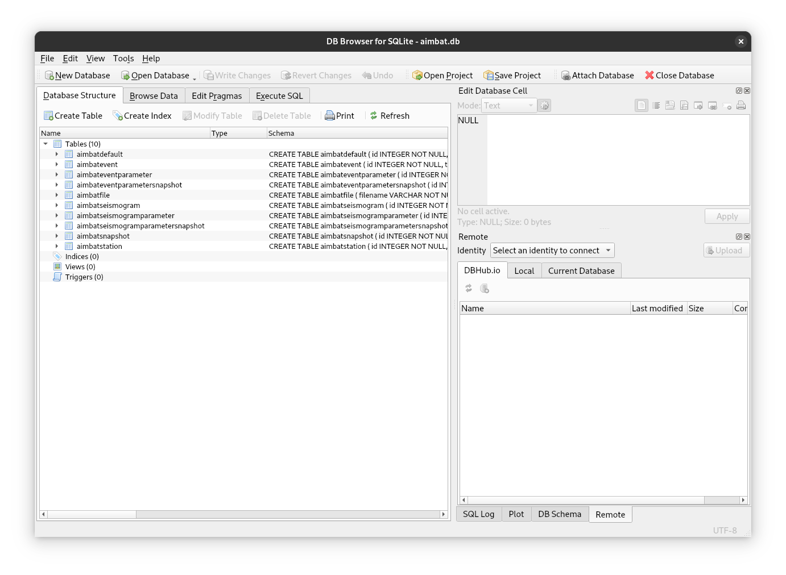

# Data

AIMBAT projects are created from [seismogram files](data.md#seismogram-files).
Event and station information, as well as initial arrival time picks are read from
these files to populate the AIMBAT [project file](data.md#project-file). The majority
of operations within AIMBAT exclusively use the project file. The contents of the
seismogram files are never modified by AIMBAT.


## Seismogram files

AIMBAT uses [SAC](https://ds.iris.edu/files/sac-manual/) files as input. Before adding
files to an AIMBAT project please ensure the following header fields are set correctly
in all files:

  - Seismogram begin time (SAC header *B*).
  - Seismogram reference time (*KZTIME*) and date (*KZDATE*).
  - Station name (*KSTNM*), latitude (*STLA*) and longitude *STLO*).
  - Event origin time (*O*), latitude (*EVLA*) and longitude (*EVLO*).

To detect any potential problems with the data before importing them into AIMBAT, you can
use the AIMBAT cli:

<!-- termynal -->

```bash
$ aimbat checkdata *.BHZ
sacfile_01.BHZ: ✓✓✓
sacfile_02.BHZ: ✓✓✓
sacfile_03.BHZ: ✓✓✓
sacfile_04.BHZ: ✓✓✓
sacfile_05.BHZ: ✓✓✓
sacfile_06.BHZ: ✓✓✓
sacfile_07.BHZ: ✓✓✓
sacfile_08.BHZ: ✓✓✓
sacfile_09.BHZ: ✓✓✓
sacfile_10.BHZ: ✓✓✓
sacfile_11.BHZ: ✓✓✓
...
sacfile_NN.BHZ: ✓✓✓

No issues found!
```

The seismogram files can be stored in an arbitrary directory (i.e. they don't necessarily
need to be stored together with an AIMBAT project file).

!!! warning

    After importing files into an AIMBAT project, their location (and contents) should
    not be changed!


## Project file

AIMBAT projects consist of a single [sqlite](https://www.sqlite.org){ target="_blank" }
file (which is automatically generated when a new project is created). This file contains
a database to manage all aspects of an AIMBAT project. Understanding the internals of this
file is not particularly important for normal AIMBAT usage, though it might be useful to
look at the data directly in cases where AIMBAT behaves in unexpected ways (e.g. due to
inconsistencies in the seismogram files used as input). To do this we suggest viewing the
database in tools such as [DB Browser for SQLite](https://sqlitebrowser.org){ target="_blank" }:
{ loading=lazy }
